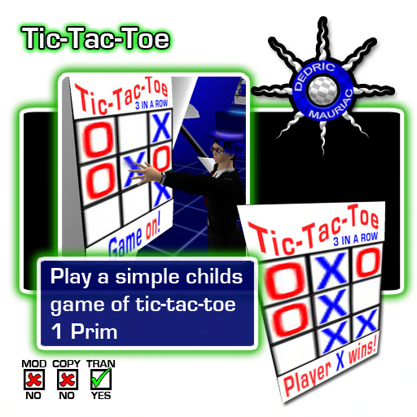

#Tic-Tac-Toe

Play a simple childs game of tic-tac-toe

This game has four different levels of play: easy, normal, hard, and impossible. When no one is playing the game, you may touch the title at the top of the board to change the level of difficulty. The following strategy is applied for each difficulty in the order specified:

**Easy:** The AI chooses a random cell that is empty.

**Normal:** AI opts to go for the win, block a win, go for center, opposite corner, any corner, or side.

**Hard:** AI opts to go for the win, block a win, 50% chance of forking, 50% chance of blocking a fork, go for center, opposite corner, any corner, or side.

**Impossible:** AI opts to go for the win, block a win, forking, blocking a fork, go for center, opposite corner, any corner, or side.

To start a game, a player can walk up and touch the bottom panel, or any of the empty cells. Once a game starts, no one else may interact with the game. If the player walks away, or does not complete the game after five minutes, the game times out and becomes available.

The goal of the game is to get three marks in a row, column, or diagonal. Any empty cell that the player touches while the game is in play will be marked with an X. The AI takes a turn afterwards and places an O in another empty cell. The game continues until the grid is full, or the goal is met. Once the game is over, the game will wait five seconds before clearing the board. At this time, someone may start a new game or change the difficulty level.

| Version | Notes                     |
| ------- | ------------------------- |
| 2.1     | Added different AI levels |
| 2.0     | Changed to 5-faced prim   |
|         | Added Title               |
|         | Added Status panel        |
| 1.0     | Initial build             |

Prims: 1